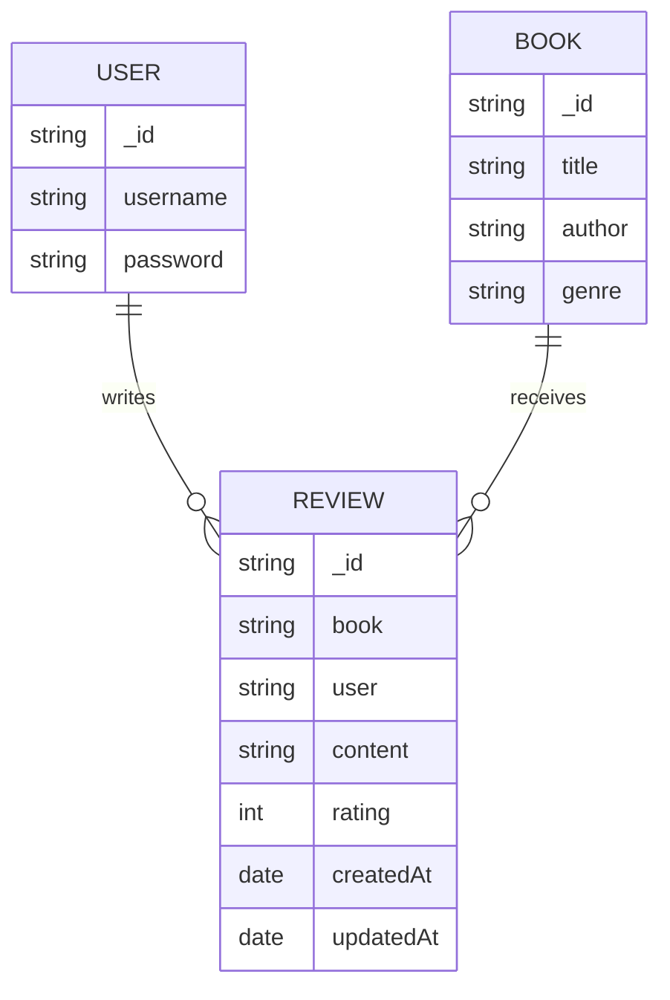

# Database Schema for Book Review API

## Entity-Relationship (ER) Description

### User

- **\_id**: ObjectId (primary key)
- **username**: String, required, unique
- **password**: String, required (hashed)

### Book

- **\_id**: ObjectId (primary key)
- **title**: String
- **author**: String
- **genre**: String
- **reviews**: [ObjectId] (references Review)

### Review

- **\_id**: ObjectId (primary key)
- **book**: ObjectId (references Book)
- **user**: ObjectId (references User)
- **content**: String
- **rating**: Number (1-5)
- **createdAt**: Date (auto-managed)
- **updatedAt**: Date (auto-managed)

## Relationships

- A **User** can write many **Reviews**.
- A **Book** can have many **Reviews**.
- A **Review** belongs to one **User** and one **Book**.

---

### (Optional) ER Diagram

- User (1) --- (_) Review (_) --- (1) Book
- Each review links a user and a book.

---

For more details, see the Mongoose models in `/models/`.
